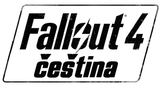

  

Od fanoušků, pro fanoušky.

Chcete nás finančně podpořit?
Informace naleznete na [profilu překladu](https://prekladyher.eu/preklady/fallout-4.79/).

## Aktuální verze

Pod odkazem níže najdete balíček s **alfa verzí** češtiny.
Tato verze neobsahuje překlady dialogových titulků, které tvoří 2/3 všech textů ve hře.
Čeština je tak určena nedočkavým hráčům, kteří nechtějí čekat na finální verzi překladu.

  <a href="../../releases/latest">
    <b>> Stáhnout nejnovější alfa verzi <</b>
  </a>

  Aktuální verze: TBD

## Manuální instalace

Čeština v nedokončené verzi nemá vlastní instalátor. Postup pro instalaci je:

1. Stáhněte ZIP balíček s češtinou kliknutím na odkaz v úvodu této stránky.
2. Obsah ZIP balíčku rozbalte do složky `Fallout 4/Data`.
3. Soubor `Fallout4Custom.ini` nahrajte do `~/Dokumenty/My Games/Fallout4/`

## Hlášení chyb

Narazíte-li na chyby v překladech, dejte nám o tom vědět zde v [sekci Issues](../../issues).
Při zakládání prosím uveďte dostatečně popisný titulek problému.
Do popisu se můžete více rozepsat a přiložit i screenshot ze hry.

Před založením chyby se ujistěte, že:

* máte aktuální verzi češtiny
* chyba nebyla zadána již někým jiným
* není chyba způsobena hraním s DLC nebo jinými herními modifikacemi
* nejde o známou chybu (viz následující podsekce)

### Známé chyby

Následující chyby prosím nehlaste jako chyby překladu:

* **Nepřeložené názvy zbraní a zbroje**
   * Názvy zbraní a zbrojí se generují v momentě, kdy jsou přidány do herního světa.
     Pokud si češtinu zprovozníte nad uloženou pozicí, nebudete mít tyto názvy přeložené.
     Pro přegenerování názvu je nutné předmět upravit na stanovišti úprav v dílně.
* **Nepřeložené slovo MODS** v rozhraní pro úpravu předmětů
    * Toto slovo bohužel nelze přeložit. Jde o chybu ve hře.
